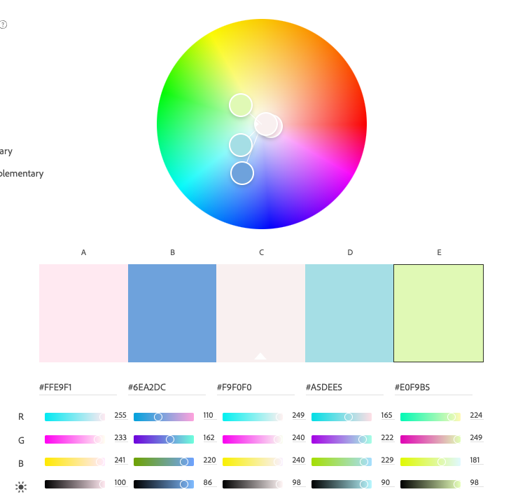
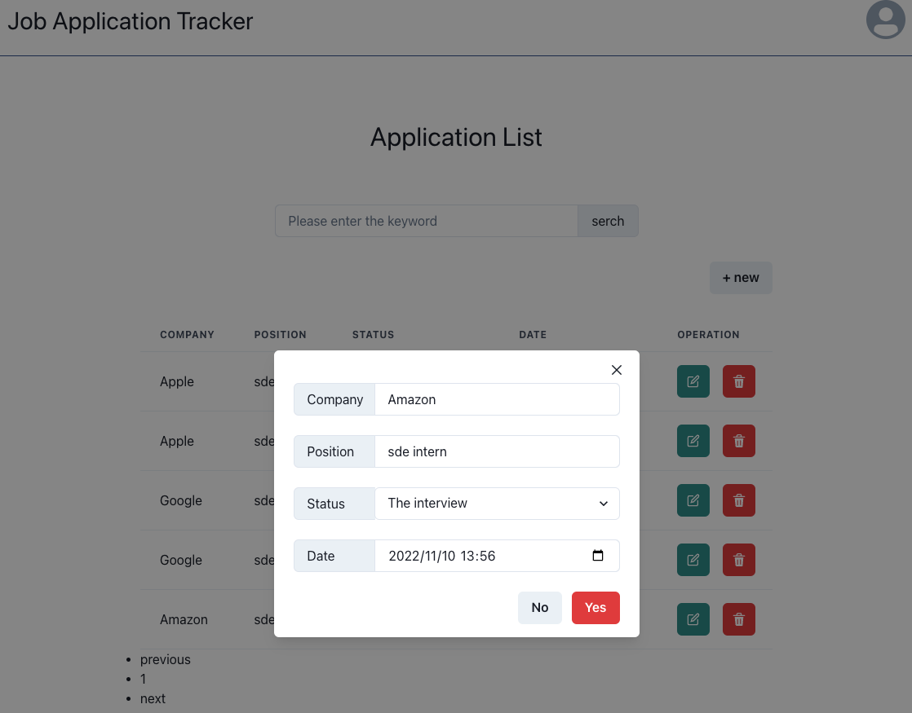
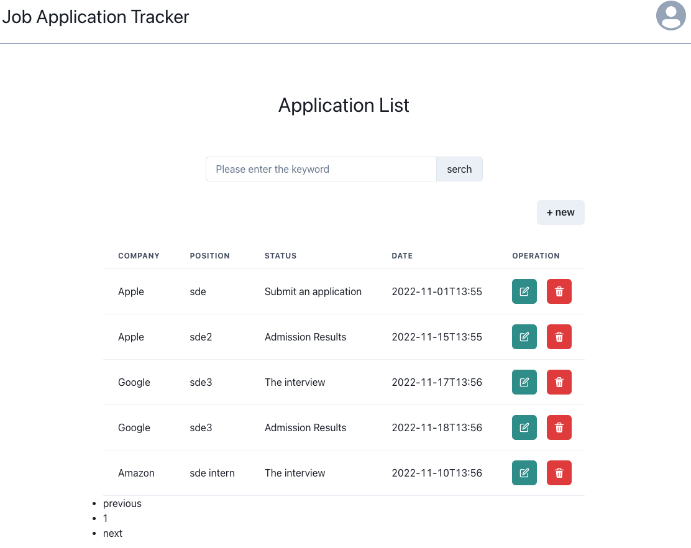
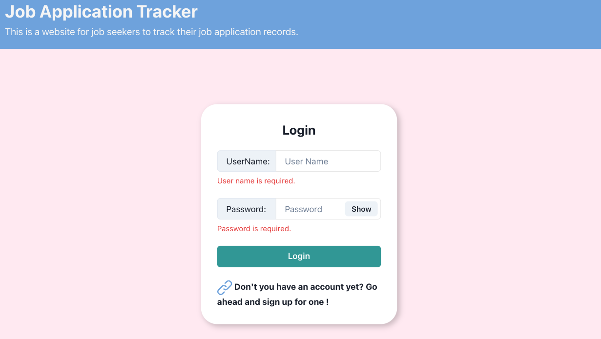
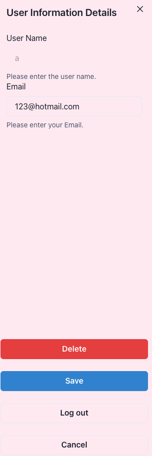
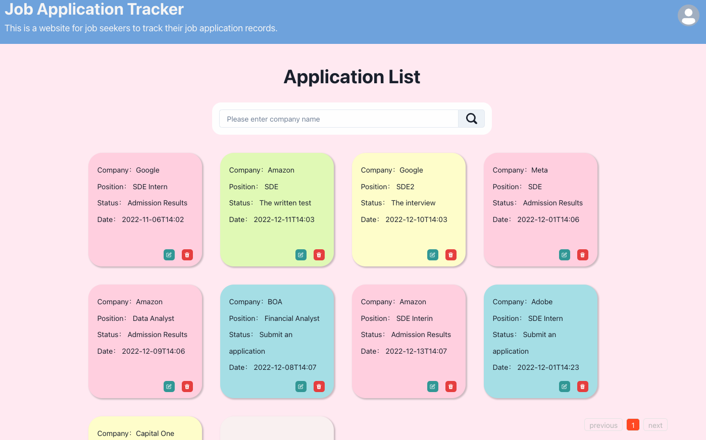
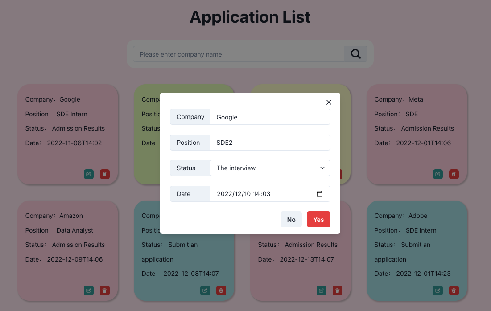

# JobApplicationTracker
This repo is a web application that provide a job application tracker for users to record all needed information about their applications.

**Author:**
 Xinlei Hu
 hu.xinl@northeastern.edu

**Website Link**
[Website](http://wake.kele.plus)

**Github Link**
[Code](https://github.com/XinleiSherry/JobApplicationTracker2.0)

**Demo Link**
[Youtube](https://youtu.be/YGS9fBCfKOg)

**Usability Study Report Link**
[Usability Study Report](https://docs.google.com/document/d/1q3gRzHdEa--rQTl767PvK3L6BnBWbZvG8k5xpiN5n2Y/edit?usp=sharing)

**Presentation Link**
[Google Slides Link](https://docs.google.com/presentation/d/1hY5qV0BkQfV8aFzWE-arHK4xYRO2sxB-NN7VzGt8wAM/edit#slide=id.g15d2d938e44_0_79)

**Design Document**
[Design Document](https://docs.google.com/document/d/1ClD_y5na-4N0zE849l8INxw8mceb8D2tSydhyy07rUc/edit?usp=sharing)

**Class Link**
[CS5610 Web Development Course](https://johnguerra.co/classes/webDevelopment_fall_2022/)

**Project Objective:**
Job Application Tracker
This is a web application that provides users with a platform to track their job application status.
Users can create account, record all job application information, and search for specific record.
 
## Installation
1. Clone the repository
2. Open it in your favourite editor
3. Run yarn install/ npm install to install node modules
4. install required dependencies and open website on heroku

## Build Dependencies and Instructions
npm init -y

npm i express

npm i --save--dev nodemon

npm start

npm build

npm i bcrypt

npm install mongodb

npm install eslint

npm install prettier

## Features
1. Users: users can create their own profile, including user name, contact information, and password. Users can view and edit their profiles as well. The user account created can also be deleted if not needed.
2. Application List View: users can search a specific application record by entering the company name in the search box at the top of the page. Also, users can jump to the previous or next page by using buttons at the bottom of the page.
3. Application List: here user can create a new application record with information including company name, position, status, date, and so on. There will be a button named “edit” to revise all the above information as well as delete that specific record. As for status, users have four options, which are “Applied”, “OA”, “VO”, and “Results”.

## Tech Requirements
1. HTML5
2. CSS3
3. JavaScript
4. Node.js 
5. express
6. React
7. MongoDB

## Improvement from v1.0 based on Usability Study Report
1. Cannot find where to register immedietly (Priority: must change) --> Added an icon at registration
2. Not sure who are target users (Priority: must change) --> Added a description under the website title
3. Black and grey color looks dull --> New colors makes user more comfortable with the website
4. Cannot find where to create new record (Priority: must change)
--> Big “+” plus sign for “create” function
5. Not sure what to enter to search for a specific record --> Eye-catching search bar
6. Application List --> Application record cards

## Color Pallet

## Job Application Tracker v1.0 looks like:
1. Sign Up and Log In - Before

2. User Management - Before

3. View Application Record - Before

4. Edit Application - Before

## Job Application Tracker v2.0 looks like:
1. Log In - After

2. User Management - After

3. View Application Record - After

4. Edit Application - After
