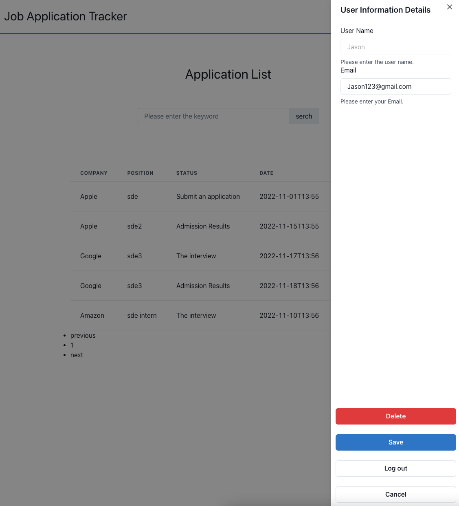

# JobApplicationTracker2.0
This repo is a web application that provide a job application tracker for job seekers to record all needed information about their job applications. 
This project was improved from JobApplicationTrackerv1.0 based on Usability Study Report and implemented some design principles.
This whole project can be used only with keyboard.
This project contains an eslint config file and was formatted using Prettier.

**Author:**
 Xinlei Hu
 hu.xinl@northeastern.edu

**Website Link**
[Website](http://wake.kele.plus)
[Deployed Website](http://43.139.124.186:5005)

**Github Link**
[Code](https://github.com/XinleiSherry/JobApplicationTracker2.0)

**Demo Link**
[Youtube](https://youtu.be/_T0SwNO2Ab4)

**Usability Study Report Link**
[Usability Study Report](https://docs.google.com/document/d/1q3gRzHdEa--rQTl767PvK3L6BnBWbZvG8k5xpiN5n2Y/edit?usp=sharing)

**Presentation Link**
[Google Slides Link](https://docs.google.com/presentation/d/1hY5qV0BkQfV8aFzWE-arHK4xYRO2sxB-NN7VzGt8wAM/edit#slide=id.g15d2d938e44_0_79)

**Design Document**
[Design Document](https://docs.google.com/document/d/1ClD_y5na-4N0zE849l8INxw8mceb8D2tSydhyy07rUc/edit?usp=sharing)

**Class Link**
[CS5610 Web Development Course](https://johnguerra.co/classes/webDevelopment_fall_2022/)

**Project Objective:**
Job Application Tracker
This is a web application that provides users with a platform to track their job application status.
Users can create account, record all job application information, and search for specific record.
 
## Instruction
1. Start the mongo local server
2. Clone the repository: https://github.com/XinleiSherry/JobApplicationTracker2.0.git
3. Open it in your favourite editor
4. cd JobApplicationTracker
5. yarn
6. yarn build
7. yarn start
8. Enter http://127.0.0.1:5005/ in the address bar of your browser
9. Better to clear browser cache

## Features
1. Users:   
a. users can create their own profiles, including username, contact information, and password.   
b. users can view and edit their profiles.  
c. users can log out.   
d. Users can delete their accounts if not needed.  

2. Application Record View:   
a. application cards created will be colored by status.   
b. users can search a specific application record by entering the company name in the search bar at the top of the page.  
c. users can jump to the previous page/next page/a specific page by using page navigation at the bottom of the page.  

3. Applications:   
a. users can create a new application record with information including company name, position, status and date.  
b. there are “edit” button to revise all the above information, and "delete" button to remove a specific record.  
c. users have four options to assign status, which are “Applied”, “OA”, “VO”, and “Results”.  

## Tech Requirements
1. HTML5
2. CSS3
3. JavaScript
4. Node.js 
5. express
6. React
7. MongoDB

## Improvement from v1.0 based on Usability Study Report
1. Cannot find where to register immedietly (Priority: must change)    
    --> Added an icon at registration
2. Not sure who are target users (Priority: must change)    
    --> Added a description under the website title
3. Black and grey color looks dull    
    --> New colors makes user more comfortable with the website
4. Cannot find where to create new record (Priority: must change)   
    --> Big “+” plus sign for “create” function
5. Not sure what to enter to search for a specific record    
    --> Eye-catching search bar
6. Application List    
    --> Application record cards

## Lighthouse Accessbility

## Color Pallet
refer to https://color.adobe.com/create/color-wheel

## Font
SFMono-Regular, Menlo, Monaco, Consolas, "Liberation Mono", "Courier New", monospace

## Job Application Tracker v1.0 looks like:
1. Sign Up and Log In - Before

2. User Management - Before

3. View Application Record - Before

4. Edit Application - Before

## Job Application Tracker v2.0 looks like:
1. Log In - After

2. User Management - After

3. View Application Record - After

4. Edit Application - After
